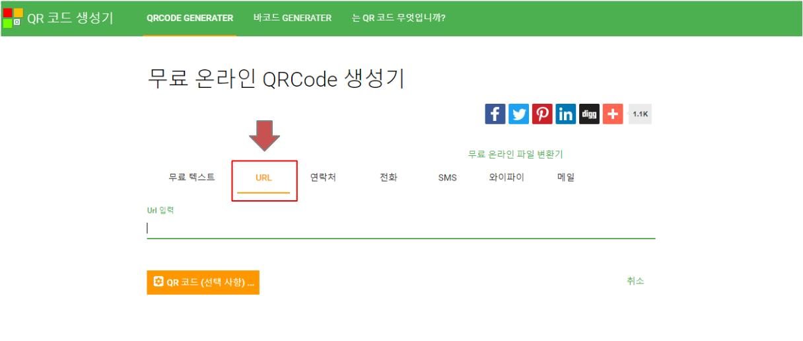
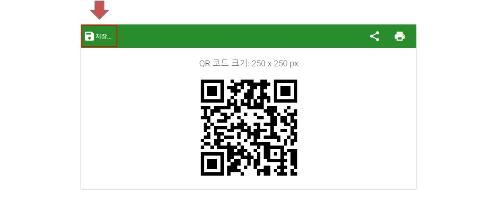

## Create QRCode

The below contents guide how to create QRCode with URL

### 1. Enter free online qrcode site

This site creates free qrcode with URL, Text, ...

> [https://ko.online-qrcode-generator.com/](https://ko.online-qrcode-generator.com/)

### 2. Select URL menu

Select URL from the top menu to create QRCode and copy the URL onto the blank 

### 3. Save QRCode to local

After copy the URL, QRCode will be created automatically as the below. Click the Save button and save it to local folder

